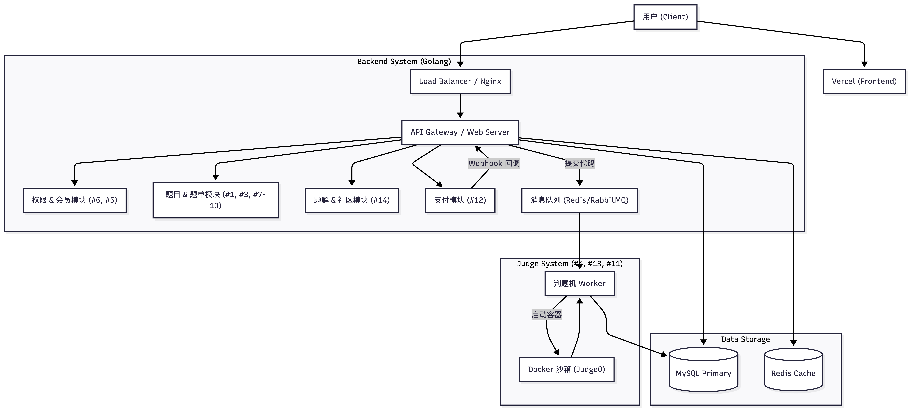

### 1. 核心业务模块 (Core Features)

这是用户直接感知到的功能区，决定了产品的用户体验。

- **题单与课程管理模块 (Curriculum & Roadmap)**
  - **结构化路径：** 这是你产品的核心差异点。你需要支持“树状”或“图状”的题单结构。
    - *功能支持：* 灵神题单（比如按知识点分类）、代码随想录（按章节）、NeetCode（按Blind 75/150）、保研机试题（按院校/年份）。
  - **进度可视化：** 用户进入某个题单后，能看到当前的进度条（e.g., "Dynamic Programming: 5/20 Solved"）。
  - **多维度筛选：** 支持按“标签（Tag）”、“难度（Difficulty）”、“来源（Source，如清华机试/北大机试）”进行筛选。
- **题目练习模块 (Problem Solving Interface)**
  - **代码编辑器：** 集成 Monaco Editor（VS Code 同款内核），支持语法高亮、自动补全、快捷键。
  - **题目描述区：** 由于全英文，需要支持 Markdown 渲染和 LaTeX 公式渲染（数学公式在保研机试题中很常见）。
  - **多语言支持：** 虽然界面是英文，但判题需要支持常见语言（C++, Java, Python, Go 等）。
- **会员与权限系统 (Membership & Access Control)**
  - **权限网关：** 这是你的变现核心。系统需要区分“公开题目（Public Problems）”和“会员题目/题单（Premium Lists）”。
  - **功能差异化：**
    - *Free User:* 只能访问 NeetCode 75 或基础算法题。
    - *Premium User:* 解锁“灵神高阶DP”、“保研真题库”以及“企业原题”。
  - **支付集成：** 对接 Stripe 或 PayPal（针对海外/全英文定位），支持订阅制（月付/年付）。

### 2. 后端核心模块 (Backend System)

- **判题机服务 (Judge Service / Execution Engine)**
  - 这是最硬核的部分。你需要一个隔离的沙箱环境来运行用户提交的代码。
  - *功能支持：* 编译代码、执行测试用例、限制内存与时间（Time/Memory Limit Exceeded）、安全性检查（防止恶意代码攻击服务器）。
  - *异步处理：* 用户提交后，不需要通过 HTTP 长连接等待，而是推送到消息队列，判题完成后通过 WebSocket 推送结果。
- **内容管理系统 (CMS / Admin Panel)**
  - 你需要一个后台来录入题目。
  - *翻译工具：* 既然你要做全英文，而“灵神”和“代码随想录”原始资料多为中文，你可能需要一个集成 AI 翻译（如 DeepL/GPT API）的辅助录入工具，快速将中文题面转为高质量英文。
  - *测试用例管理：* 上传 Input/Output 文件，或者编写 Special Judge 脚本。

### 3. 数据与用户模块 (Data & User)

- **用户个人档案 (User Profile)**
  - **能力雷达图：** 根据用户在不同 Tag 下的刷题通过率，生成能力六边形（如：Graph 强，DP 弱）。
  - **打卡热力图：** 类似 GitHub 的提交记录绿格子，增加用户粘性。
  - **收藏夹/错题本：** 用户遇到难题可以标记 "Review Later"。
- **社区与讨论 (Discussion / Forum)**
  - 即使是简单的评论区也非常重要。
  - *功能支持：* 题解区（Solutions），支持用户发布 Markdown 格式的题解，支持点赞和置顶。

### 4. 推荐的技术架构概览

为了实现上述功能，通常的技术选型思路如下：

| **模块**     | **建议技术栈**                    | **备注**                                       |
| ------------ | --------------------------------- | ---------------------------------------------- |
| **前端**     | React / Next.js + Tailwind CSS    | Next.js 利于 SEO（全英文内容容易获取搜索流量） |
| **编辑器**   | Monaco Editor                     | 行业标准                                       |
| **后端 API** | Go (Gin/Echo) 或 Node.js (NestJS) | Go 在处理高并发和判题服务上有优势              |
| **数据库**   | PostgreSQL + Redis                | PG 存题目/用户，Redis 存排行榜/缓存            |
| **判题沙箱** | Judge0 (开源) 或 自研 Docker 容器 | 推荐初期直接使用成熟的开源方案 Judge0          |
| **部署**     | AWS / Vercel + Docker             |                                                |

### 总结：你需要完成的最小可行性产品 (MVP)

如果第一阶段资源有限，建议优先完成：

1. **题目列表页**（仅做 NeetCode 和 灵神基础题）。
2. **核心判题流程**（代码提交 -> 运行 -> 返回 Pass/Fail）。
3. **基础鉴权**（简单的 Login 和 VIP 标记，甚至可以是手动开通）。
4. **英文内容录入**（先人工精翻 50-100 道高质量题目）。

**你希望我针对“判题机（Judge Server）”的具体实现逻辑，还是“会员权限系统”的设计做进一步的详细拆解？**

### "English Communication & Scripting"（英语表达特训模块）

这是留学生和国内学生最大的痛点。代码能写出来，但用英文边写边讲（Think Aloud）很难。

- **Standard Scripts（标准话术库）：**
  - 针对每道经典题（比如 Two Sum, LRU Cache），提供一套标准的**英文口述模版**。
  - *例如：* "I will use a hash map to store the indices..." 而不是中式英语的 "I open a map..."。
  - *会员功能：* 解锁所有题目的“满分英语回答脚本”（Script）。
- **Behavioral Questions (BQ) for Engineers：**
  - 美国面试非常看重 BQ（Amazon LP, Google Googlyness）。
  - 提供针对中国工程师背景优化的 BQ 回答范例（如何把国内的“卷”转化为美式的“Impact”和“Ownership”）。

### 2. "System Design for Juniors/New Grads"（面向校招/初级的系统设计）

虽然你是面向保研/留学生，但现在美国顶尖公司（如 TikTok/ByteDance US, Meta, Databricks）的校招或早期社招经常考察 OOD（面向对象设计）或轻量级系统设计。

- **OOD 实战：** 比如“设计一个停车场”、“设计一个文件系统”。这在 LeetCode 上资源较少，但在面试中很常见。
- **后端组件专栏：** 结合你擅长的 Redis/MySQL/Go，专门做一个“面试中如何用英文深入讨论数据库与并发”的专题。
  - *例子：* "How to explain Optimistic Locking in English?"（如何用英文解释乐观锁？）

### 3. "OA & Company Tags"（最新的 OA 机经与公司真题）

留学生找工非常依赖 OA（Online Assessment）。

- **Real-time OA Pool（本季度 OA 题库）：**
  - 这是最强的**会员付费点**。收集 Amazon, TikTok, Goldman Sachs 等公司当季度的 OA 原题。
  - 因为你定位是“英文题单”，可以直接聚合国外 Discord 或 Telegram 里的最新真题，整理后给会员用。
- **针对性题单：**
  - **"ByteDance Style"：** 字节系面试特别喜欢考 Hard 题和 DP，你可以专门整理一个“字节高频英文版”。
  - **"Quant Style"：** 针对想去 Jane Street, Citadel 的学生，整理概率题和 C++ 底层题。

### 5. "Baoyan Hard Mode"（国内保研机试特供）

国内保研机试（清华、北大、上交、浙大）的风格和 LeetCode 不太一样，更偏向 ACM 竞赛风格，或者是“大模拟”（Large Implementation）。

- **Complex Implementation（大模拟专栏）：**
  - 很多留学生怕写代码量大的题。你可以专门整理这类题目，训练代码极其复杂的场景下的准确性。
- **Input/Output Handling（ACM 模式训练）：**
  - LeetCode 是核心代码模式，但国内机试和部分美国公司（如 Palantir, OA 平台 HackerRank）需要处理 STDIN/STDOUT。你需要一个模块专门训练这种 I/O 处理。

### 爬1p3a和xhs上的面经

### 架构
